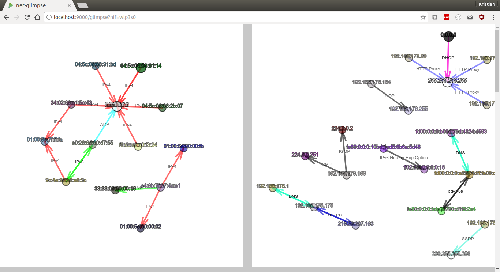
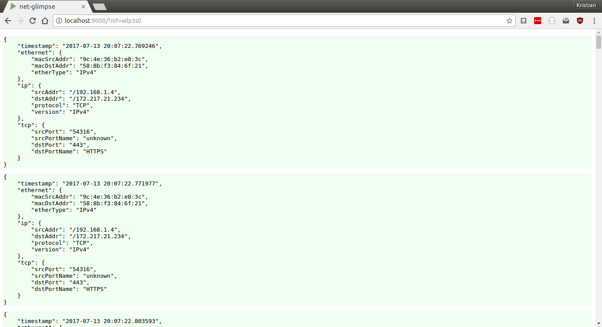
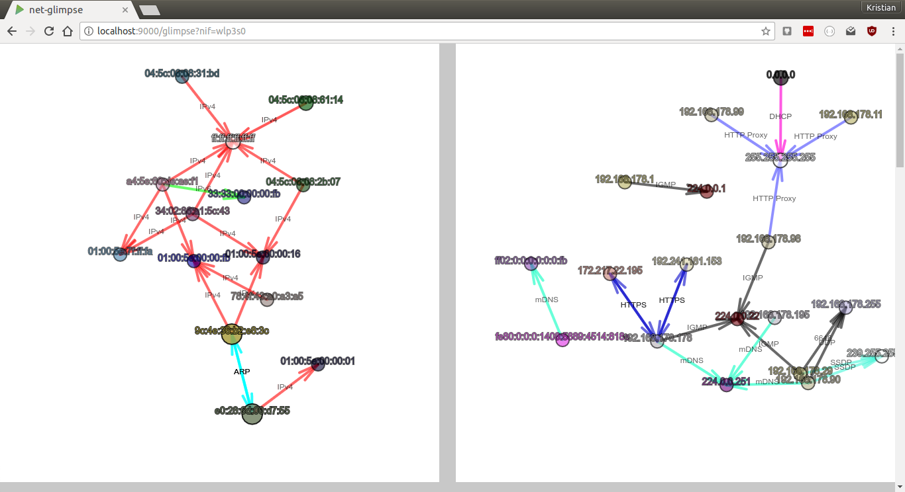
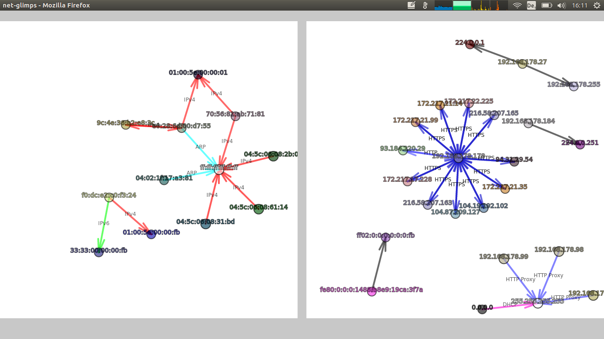

I wanted a little tool that gives me a quick overview on what's going in my network right now, displaying it in the browser  so I can access it easily whenever I want. Tools like tcpdump or [Wireshark](https://www.wireshark.org/) are great but don't give you this 'glimpse'.

net-glimpse has two parts: 1) Visualization of network traffic (Ethernet and/or Internet) in real-time, and 2) Streaming of header data from your network interfaces via WebSockets.

**Have a look at [this video](https://youtu.be/Nvm5NaTZLGY).**



### Used technologies

* Scala, JavaScript
* Pcap4J (https://github.com/kaitoy/pcap4j) to access network interfaces
* Play Framework and sbt
* [Akka](http://akka.io/) to distribute network interface data to multiple WebSockets
* Graphics with [p5js](https://p5js.org/) and physics with [toxiclibs](https://github.com/hapticdata/toxiclibsjs)

### Contents

* [How to run](#how-to-run)
  * [Prerequisites](#prerequisites)
  * [Install and run](#install-and-run)
* [Visualization of network traffic](#visualization-of-network-traffic)
  * [Endpoints](#endpoints)
  * [Visualization Details](#visualization-details)
  * [Visualization Configuration](#visualization-configuration)
* [Streaming of header data from your network interfaces via WebSockets](#streaming-of-header-data-from-your-network-interfaces-via-websockets-backend)
  * [Usage in JavaScript](#usage-in-javascript)
  * [Backend configuration](#backend-configuration)
* [Build yourself and modify the source code](#build-yourself-and-modify-the-source-code)  


## How to run

net-glimpse works on **Linux/Unix** (including **Mac OS X**) and **Windows**.

### Prerequisites

* net-glimpse needs **Java 8** (JRE is enough) to run.
* For the visualizations you need a modern browser (one that supports WebSockets and WebGL).
* On **Windows** it is necessary to install _Npcap_ (https://nmap.org/npcap/) **OR** _WinPcap_ (https://www.winpcap.org/). On **Linux/Unix** _libpcap_ is needed.

### Install and run

1. [Download the net-glimpse-x.x.zip](https://github.com/kristian-lange/net-glimpse/releases)

1. Unzip and change into the unzipped folder

1. On **Linux or Unix** to access network interfaces you have to start the net-glimpse either as **root** or give Java special capabilities, e.g. with `sudo setcap cap_net_raw,cap_net_admin=eip /usr/lib/jvm/java-8-openjdk-amd64/jre/bin/java` (but exchange the path to your Java installation). On **Windows** you will be ask after starting net-glimpse's batch file if you want to grant access to the network interfaces.

1. On **Unix** it might be necessary to make the run script executable: `chmod u+x ./bin/net-glimpse`

1. Run on **Linux or Unix** in the terminal `./bin/net-glimpse` - on **Windows** double-click the `./bin/net-glimpse.bat`
   
   You can specify IP and port with the parameters `-Dhttp.address` and `-Dhttp.port`. E.g. `./bin/net-glimpse -Dhttp.address=172.23.1.81 -Dhttp.port=8080` binds net-glimpse to IP `172.23.1.81` and port `8080`. If you don't specify these parameters the defaults `0.0.0.0` (listens all addresses) and `9000` are used.
   
   If net-glimpse does not want to start have a look in its installation folder whether you find a file RUNNING_PID. Delete it and start again.

1. Try in a browser, e.g. with `http://localhost:9000/?nif=myNetworkInterface` (instead of `myNetworkInterface` use the name of the network interface you want to intercept)
   
   net-glimpse prints out potential network interface names (NIF) in it's log. You can copy-paste one from there. This is especially handy on **Windows** where they have names like, e.g. `\Device\NPF_{998BB72F-3468-413E-813C-7E3A2E7B591B}` which would lead to the URL `http://localhost:9000/?nif=\Device\NPF_{998BB72F-3468-413E-813C-7E3A2E7B591B}`.
   
   The resulting webpage shows a list of raw packet header data in JSON format.
   
   

1. If you are done with net-glimpse you can stop it with `Ctrl+C`.


## Visualization of network traffic

### Endpoints

1. `http://localhost:9000/glimpse?nif=myNetworkInterface` - shows both, Ethernet and Internet
   
1. `http://localhost:9000/ipglimpse?nif=myNetworkInterface` - shows only Internet
   
1. `http://localhost:9000/etherglimpse?nif=myNetworkInterface` - shows only Ethernet

1. `http://localhost:9000/?nif=myNetworkInterface` - shows raw packet header data in JSON

E.g. [`http://localhost:9000/glimpse?nif=wlp3s0`](http://localhost:9000/glimpse?nif=wlp3s0) shows a visualization of the Ethernet layer and the Internet layer of the network interface `wlp3s0`. 



**You can open multiple pages of the same or different network interface(s) at the same time.**

### Visualization Details 

* You can press 'p' to pause the drawing at any time
* It's actually a [force-directed graph](https://en.wikipedia.org/wiki/Force-directed_graph_drawing)
* Nodes represent MAC or IP addresses
* Node colors are determined by the MAC or IP address (means the same MAC or IP address leads always to the same color)
* Nodes with broadcast or multicast IP addresses are white.
* Nodes and edges blink when a new packet is sent
* Edges represent sent packets
* The arrow shows the direction of the sent packet
* The edges get thicker the more packets are sent
* The EtherType (in the Ethernet visualization) is annotated at the edge (scroll down - under the graphic is a glossary)
* In the Internet visualization if it is a TCP or UDP packet and the port is one of the well known or registered ones (port 0 to 49151) the port is annotated at the edge. The most common port numbers are exchanged with their names, eg. port 22 is exchanged with SSH (scroll down - under the graphic is a glossary).
* If it's the Internet and not a TCP or UDP packet then the protocol name is annotated at the edge.
* Edges of unknown EtherTypes or Internet packets are black/gray by default (but you can add new types in the config)
* Nodes and edges get removed after a while if no packets are sent (default is 10 s)
* In fullscreen mode the whole screen is used for the graph(s) - otherwise they have a squared canvas

### Visualization Configuration

Many parameters of the visualizations can be changed, e.g.

* Edge colors and annotation
* Node size and node repulsion
* Cleaning interval and max age of nodes
* Blacklist and whitelist for IP and MAC addresses 

The configuration file is in [`./config/glimpse.conf`](https://github.com/kristian-lange/net-glimpse/blob/master/conf/glimpse.conf). More details are in the comments of the config file.




## Streaming of header data from your network interfaces via WebSockets (backend)

Usually it's not possible to access network interfaces from within a browser. net-glimpse uses pcap4j to access the interfaces and then streams the header data via WebSockets into the browser. You can use this part of net-glimpse independent of the visualization.

### Usage in JavaScript

If you just want to get the header data without the visualization you have to open a WebSocket with the URL `/netdata` and the network interface you want to intercept has to be specified in the query string with the parameter 'nif'. 

E.g. in JavaScript (browser) to get traffic from the network interface `wlp3s0` one could write

```javascript
var socket = new WebSocket("ws://myhost/netdata/?nif=wlp3s0");
```

or more generally with secure WebSockets and assuming net-glimpse runs on the same host as your JavaScript is served from.

```javascript
var socket = new WebSocket(
      ((window.location.protocol === "https:") ? "wss://" : "ws://") +
      window.location.host + "/netdata/?nif=wlp3s0");
```

The streamed packet header data are in JSON format.

* It is possible to **stream different network interfaces in parallel**.
* It is also possible to **stream the same network interface to multiple destinations**.
* Only header data are captured and streamed via WebSockets - the actual payload is not read.

### Backend configuration

#### Via -D run parameters

net-glimpse takes a couple of parameters:

* `-Dnif` - Specifies the default network interface. If you specify it here you can leave it out in the URL query. It has no default.
* `-DskipOwnTraffic` - If true net-glimpse's own network traffic (via WebSockets) is not streamed. Default is `true`.
* `-Dsnaplen` - Sets the snap length (see [wiki.wireshark.org/SnapLen](https://wiki.wireshark.org/SnapLen) for more info). Default is `128` byte.
* `-Dhttp.address` - Specifies the IP address net-glimpse runs on. Default is `0.0.0.0` (listens on all IPs).
* `-Dhttp.port` - Specifies the port net-glimpse runs on. Default is `9000`.

e.g. `./bin/net-glimpse -Dhttp.address=192.168.178.160 -Dhttp.port=80 -Dnif=wlp3s0 -DskipOwnTraffic=false`

#### Via `conf/application.conf`

All parameters that can be specified via -D run parameters can be set in `./conf/application.conf` too.


## Build yourself and modify the source code

If you don't trust net-glimpse' pre-build releases you can build it yourself. It uses [sbt](http://www.scala-sbt.org/) as build tool. Just download the source code and run `sbt dist`. In `./target/universal/` will be the built `.zip` file. More information can be found in https://www.playframework.com/documentation/2.5.x/Deploying or https://www.playframework.com/documentation/2.5.x/BuildOverview.

If you want to modify the source code (e.g. you need more data from the network packets) the following files are probably where you want to start:

* [/app/services/PacketToJsonTransfer.scala](https://github.com/kristian-lange/net-glimpse/blob/master/app/services/PacketToJsonTransfer.scala) - serialises the packet data into JSON (backend-side)
* [/public/netDataReceiver.js](https://github.com/kristian-lange/net-glimpse/blob/master/public/netDataReceiver.js) - deserialising JSON in the browser
* [/public/p5visu.js](https://github.com/kristian-lange/net-glimpse/blob/master/public/p5visu.js) - visalisation with p5.js
* [/public/graph.js](https://github.com/kristian-lange/net-glimpse/blob/master/public/graph.js) - graph data structure and physics
